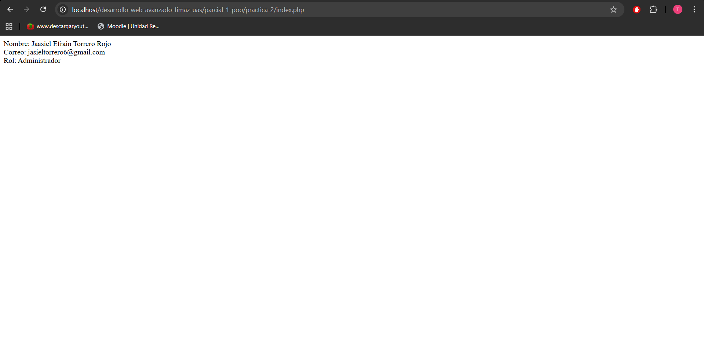

# Practica 2 - Herencia y reutilización de codigo en php

## Descripción
En esta práctica se implementa herencia utilizando la clase Admin  que extiende la clase Usuario para reutilizar sus atributos y métodos.

## diferencia entre usuario y admin

### Usuario
Clase base que contiene:
- nombre
- correo
- métodos getter y setter

### Admin
Clase hija que extiende Usuario y agrega el método:
getRol() → retorna "Administrador"

## Ejecución

1. Colocar la carpeta en htdocs
2. Iniciar Apache en XAMPP
3. Abrir en el navegador:

http://localhost/desarrollo-web-avanzado-fimaz-uas/parcial-1-poo/practica-2/index.php

## Resultado esperado

